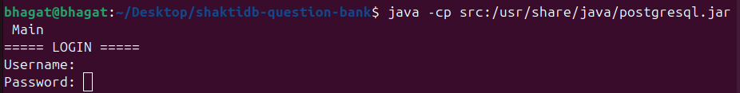
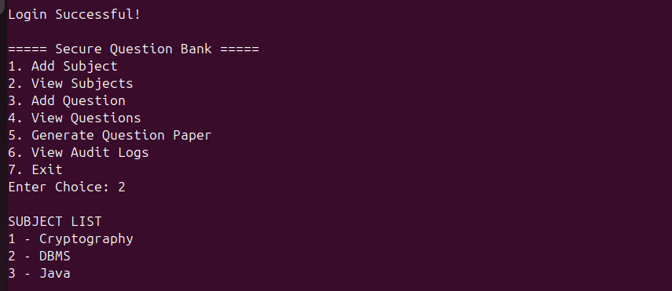
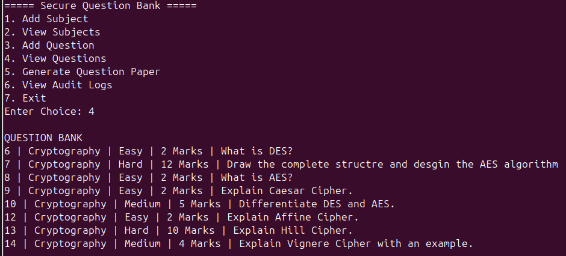
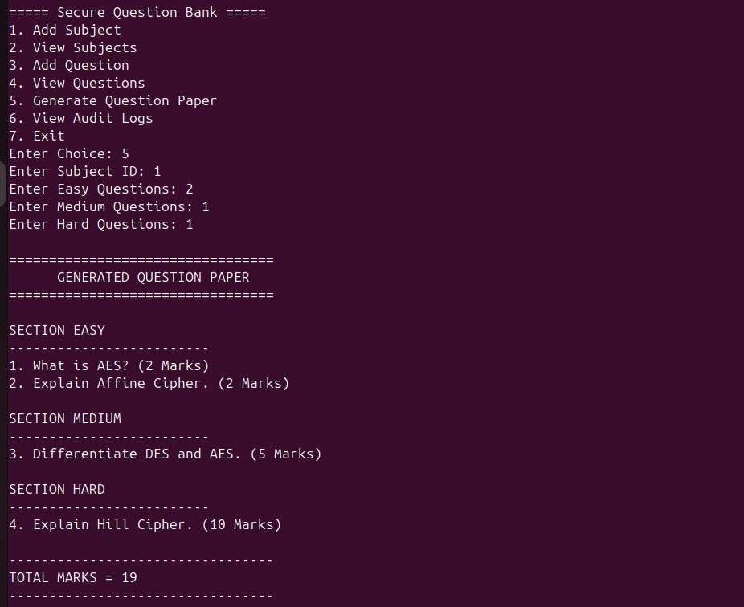
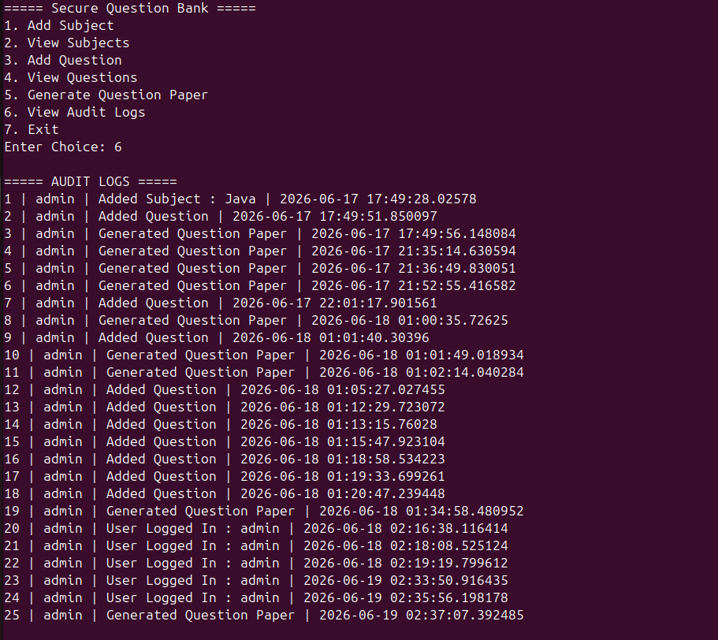
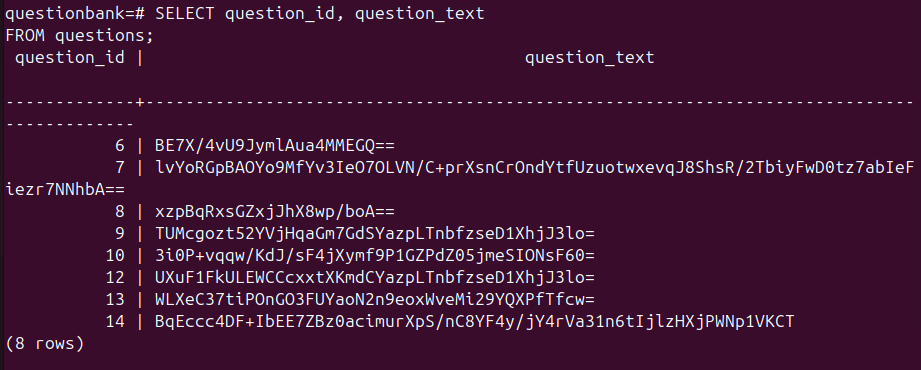

# Secure Examination Question Bank using ShaktiDB

## Overview

Secure Examination Question Bank is a Java-based database application developed using ShaktiDB and JDBC. The system enables secure storage and management of examination questions while providing authentication, audit logging, encryption, and randomized question paper generation.

The primary objective of the project is to demonstrate how database security techniques can be applied to protect sensitive examination content from unauthorized access. Questions are encrypted using AES before being stored in the database and are automatically decrypted when viewed through the application.

---

## Motivation

Educational institutions increasingly rely on digital systems to manage examination content. As examination data becomes more valuable and sensitive, protecting question banks from unauthorized access has become an important requirement.

Many traditional systems store questions in plain text, making them vulnerable if the database is accessed by unauthorized users. This project demonstrates how encryption, authentication, audit logging, and secure database practices can be combined to build a more secure examination management solution.

The project serves as a proof-of-concept for secure academic assessment systems where confidentiality, integrity, and accountability are important.

---

## Features

### User Authentication

* Login-based access control
* User credentials stored in ShaktiDB
* Prevents unauthorized access to the system

### Subject Management

* Add new subjects
* View existing subjects
* Subject-wise organization of questions

### Question Management

* Add examination questions
* Assign difficulty levels

  * Easy
  * Medium
  * Hard
* Assign marks to each question

### AES Encryption

* Questions are encrypted before storage
* Sensitive examination content is protected inside the database
* Automatic decryption during retrieval

### Random Question Paper Generation

* Generate question papers based on:

  * Subject
  * Number of Easy questions
  * Number of Medium questions
  * Number of Hard questions
* Questions are selected randomly using database queries
* Automatic total marks calculation

### Audit Logging

* Records important system activities
* Tracks:

  * Login attempts
  * Subject creation
  * Question additions
  * Question paper generation
* Provides accountability and traceability

---

## Technologies Used

| Component             | Technology                         |
| --------------------- | ---------------------------------- |
| Programming Language  | Java 17                            |
| Database              | ShaktiDB 17.10.1.0                 |
| Database Connectivity | JDBC                               |
| Operating System      | Ubuntu Linux                       |
| Version Control       | Git                                |
| Repository Hosting    | GitHub                             |
| Encryption            | AES (Advanced Encryption Standard) |

---

## System Architecture

User

↓

Java Application

↓

JDBC

↓

ShaktiDB

↓

Encrypted Question Storage

---

## Database Design

### users

| Column   | Description    |
| -------- | -------------- |
| user_id  | User ID        |
| username | Login username |
| password | Login password |
| role     | User role      |

---

### subjects

| Column       | Description  |
| ------------ | ------------ |
| subject_id   | Subject ID   |
| subject_name | Subject name |

---

### questions

| Column        | Description            |
| ------------- | ---------------------- |
| question_id   | Question ID            |
| subject_id    | Associated subject     |
| difficulty    | Easy / Medium / Hard   |
| marks         | Marks assigned         |
| question_text | AES encrypted question |

---

### audit_logs

| Column   | Description            |
| -------- | ---------------------- |
| log_id   | Log ID                 |
| username | User performing action |
| action   | Activity description   |
| log_time | Timestamp              |

---

## Security Features

### AES Encryption

Before storing a question:

Question:

What is Caesar Cipher?

Encrypted Value Stored in Database:

HLpS7klujy77dmigQsCcXvV4NlHe7AMhbnQwGHZn+r0=

The application automatically decrypts questions during retrieval.

---

### Authentication

Users must log in before accessing system features.

Default Login:

Username: admin

Password: admin123

---

### Audit Trail

Every important action is recorded.

Examples:

* User Logged In
* Added Subject
* Added Question
* Generated Question Paper

This helps track system usage and provides accountability.

---

## Sample Workflow

1. User logs into the system.
2. User creates subjects.
3. User adds encrypted questions.
4. Questions are stored securely in ShaktiDB.
5. User generates a random question paper.
6. Questions are decrypted and displayed.
7. Activities are recorded in audit logs.

---

## How to Compile

Compile all Java files:

```bash
javac -cp /usr/share/java/postgresql.jar src/*.java
```

## How to Run

```bash
java -cp src:/usr/share/java/postgresql.jar Main
```

---

## Sample Menu

```text
===== Secure Question Bank =====

1. Add Subject
2. View Subjects
3. Add Question
4. View Questions
5. Generate Question Paper
6. View Audit Logs
7. Exit
```
---

# Screenshots

## Login Screen



---

## Subject Management



---

## Question Bank



---

## Generated Question Paper



---

## Audit Logs



---

## Encrypted Questions Stored in ShaktiDB

The database stores encrypted questions using AES encryption.



---

## Future Enhancements

* Password hashing using BCrypt
* Role-based access control
* GUI using JavaFX
* PDF question paper generation
* Question approval workflow
* Multiple administrator support
* Backup and recovery module

---
## Author

BHAGAT KRISHNA

B.Tech CSE

TKM College of Engineering

Mini Project developed using ShaktiDB.

